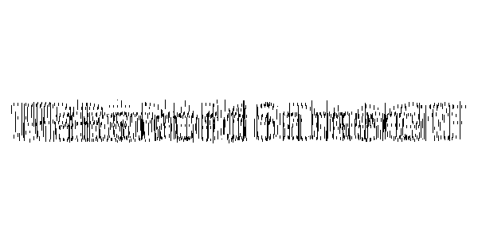
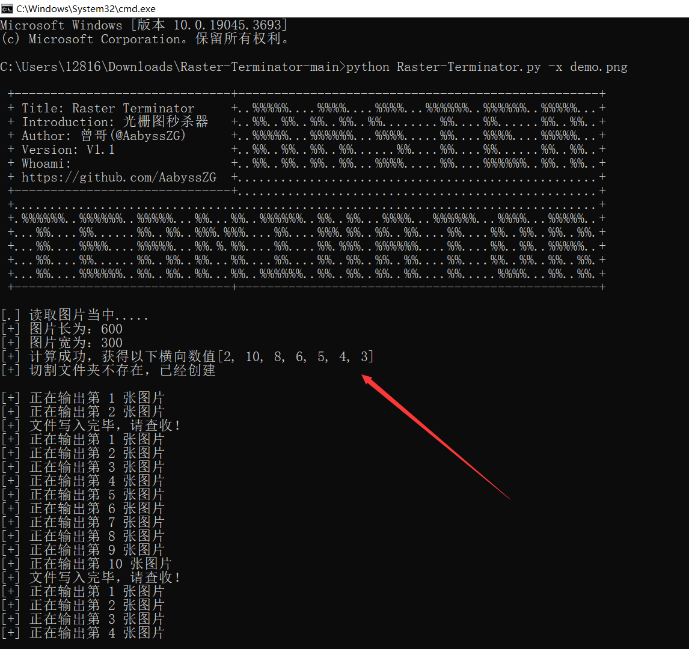
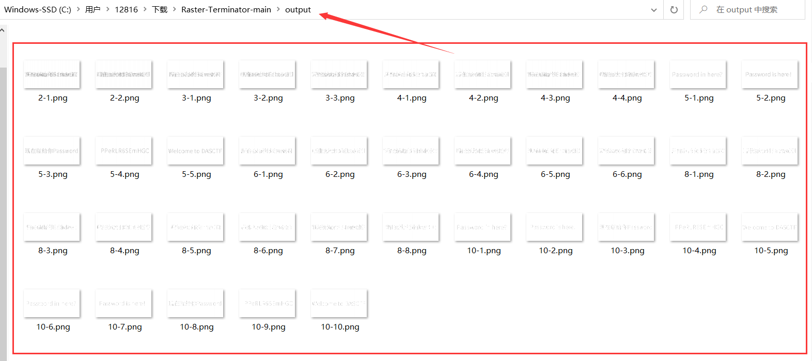
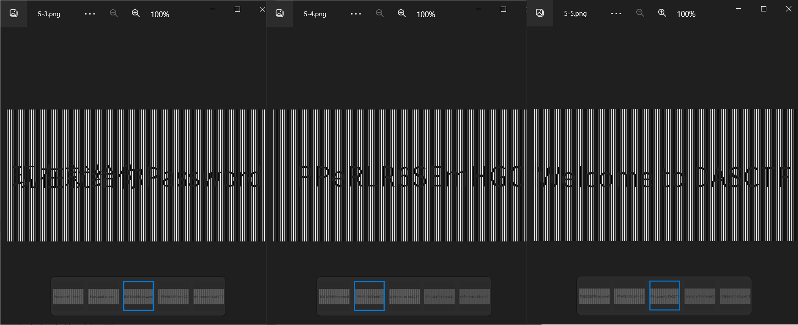

>python3 Raster-Terminator.py -h
usage: Raster-Terminator.py [-h] [-x XCOORDINATE] [-y YCOORDINATE] [-i IMAGEOUT]

Raster Terminator V1.1

optional arguments:
  -h, --help      show this help message and exit
  -x XCOORDINATE  自动读取图片并尝试爆破横向光栅图
  -y YCOORDINATE  自动读取图片并尝试爆破纵向光栅图
  -i IMAGEOUT     自定义爆破光栅图

自动读取图片并尝试爆破光栅，诸如：python3 Raster-Terminator.py -x demo.png
```

## 3#使用样例

**使用场景：当你在解Misc题目，发现存在光栅图，如下图所示**



根据图片长宽比，认为应该是横向隐写，直接尝试运行脚本

```
python3 Raster-Terminator.py -x demo.png
```



该脚本会自动根据图片长宽进行计算，最终得到光栅提取量



会自动生成 `./output` 目录并将提取出的图片输出到目录里面



成功解出光栅图内隐藏的关键信息


